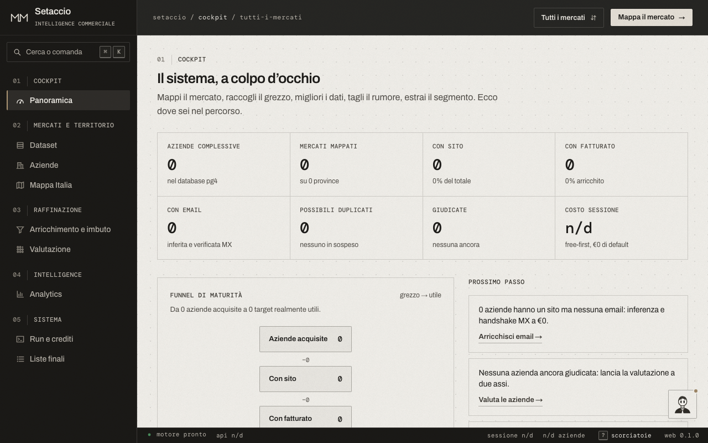
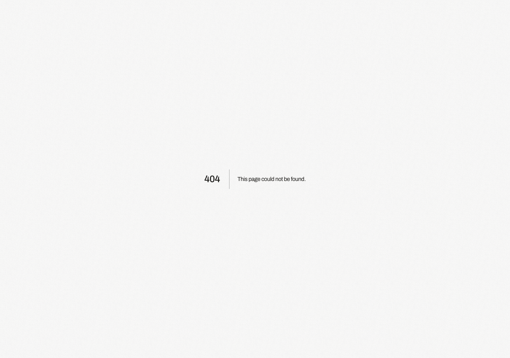
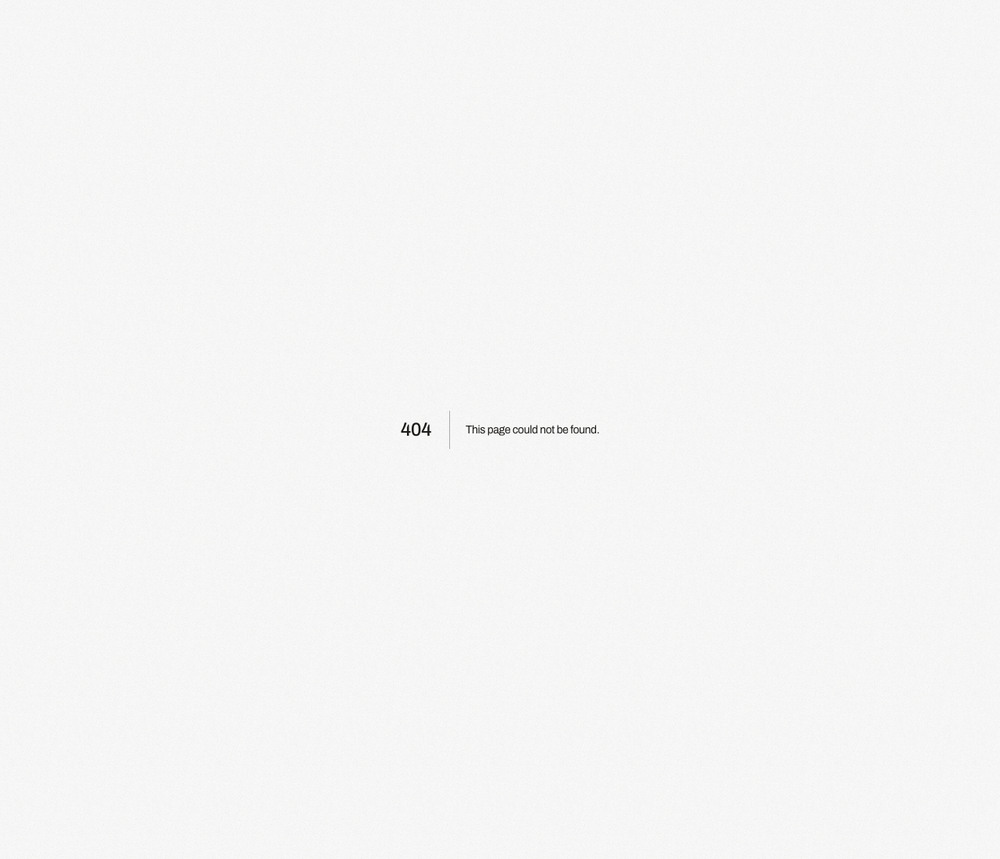
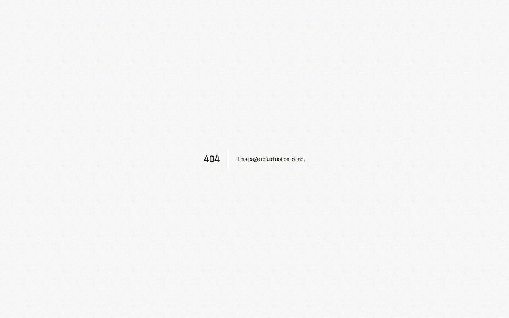

# Valutatore Immobiliare Delfino

<p align="center">
  
  
  
  
  
  
</p>

Sistema avanzato di valutazione immobiliare sincrona e intelligenza documentale per agenzie immobiliari italiane (Delfino Real Estate).

Il sistema unisce un **funnel conversazionale venditore** ad alta conversione con un **intelligence engine deterministico a più livelli** (OMI + Comparabili MCA + Regressione Edonica + Zone Intelligence + Correzione Bounded Claude 5.5) e una **dashboard operativa dedicata per gli agenti**, completando il ciclo con la perizia formale e la chiusura del flywheel di apprendimento.

---

## 📸 Anteprima & Interfaccia

<p align="center">
  <b>Landing Page & Funnel di Acquisizione</b><br/>
  
</p>

<p align="center">
  <b>Funnel Conversazionale Multi-Step (/valutazione)</b><br/>
  
</p>

<p align="center">
  <b>Report Editoriale di Stima (Dossier Agente & Scheda Cliente)</b><br/>
  
</p>

<p align="center">
  <b>Area Riservata Agenti (/agenti/login)</b><br/>
  
</p>

---

## 📑 Indice Generale

1. [Principi Architetturali Fondamentali](#1-principi-architetturali-fondamentali)
2. [Guida Operativa per gli Agenti Immobiliari (Agent Playbook)](#2-guida-operativa-per-gli-agenti-immobiliari-agent-playbook)
   - [2.1 Accesso alla Dashboard e Triage dei Lead](#21-accesso-alla-dashboard-e-triage-dei-lead)
   - [2.2 Come Leggere la Scheda di Valutazione](#22-come-leggere-la-scheda-di-valutazione)
   - [2.3 Caricamento Documenti (Upload Diretto ad Alta Velocità)](#23-caricamento-documenti-upload-diretto-ad-alta-velocità)
   - [2.4 Analisi Documentale & Riconciliazione con il Catasto](#24-analisi-documentale--riconciliazione-con-il-catasto)
   - [2.5 Generazione della Perizia Formale e Narrazione](#25-generazione-della-perizia-formale-e-narrazione)
   - [2.6 Generazione e Consegna del Report Cliente](#26-generazione-e-consegna-del-report-cliente)
   - [2.7 Chiusura Pratica e Flywheel (Finalize)](#27-chiusura-pratica-e-flywheel-finalize)
3. [Architettura del Sistema & Flusso Dati](#3-architettura-del-sistema--flusso-dati)
   - [3.1 Funnel Venditore & Geocoding](#31-funnel-venditore--geocoding)
   - [3.2 Pipeline Sincrona & Garanzie Transazionali](#32-pipeline-sincrona--garanzie-transazionali)
   - [3.3 Architettura Direct-to-Storage (Bypass Limiti Serverless)](#33-architettura-direct-to-storage-bypass-limiti-serverless)
4. [Il Motore di Valutazione (Dettaglio Matematico)](#4-il-motore-di-valutazione-dettaglio-matematico)
   - [4.1 Superficie Commerciale DPR 138/1998 & Scorporo Box](#41-superficie-commerciale-dpr-1381998--scorporo-box)
   - [4.2 Risoluzione OMI Spaziale & Anti-Double-Counting](#42-risoluzione-omi-spaziale--anti-double-counting)
   - [4.3 Griglia MCA (Market Comparison Approach) & Shrinkage](#43-griglia-mca-market-comparison-approach--shrinkage)
   - [4.4 Regressione Edonica Ridge (Premi Marginali di Mercato)](#44-regressione-edonica-ridge-premi-marginali-di-mercato)
   - [4.5 Zone Intelligence & Correzione Vincolata Claude 5.5](#45-zone-intelligence--correzione-vincolata-claude-55)
   - [4.6 Confidenza FSD e Range Dinamico](#46-confidenza-fsd-e-range-dinamico)
5. [Document Intelligence & AI Pipeline](#5-document-intelligence--ai-pipeline)
   - [5.1 Vision Multimodale (Planimetria & APE)](#51-vision-multimodale-planimetria--ape)
   - [5.2 Trascrizione Note Vocali Agente (Whisper)](#52-trascrizione-note-vocali-agente-whisper)
   - [5.3 Reconciler Intelligente & Guardrail Deterministico](#53-reconciler-intelligente--guardrail-deterministico)
   - [5.4 Ottimizzazione Prompt Caching Claude (Law 501)](#54-ottimizzazione-prompt-caching-claude-law-501)
6. [Database, Sicurezza & Permessi RLS](#6-database-sicurezza--permessi-rls)
   - [6.1 Struttura Tabelle & Migrazioni (0001–0027)](#61-struttura-tabelle--migrazioni-00010027)
   - [6.2 Trigger Guard Dinamico con Diff JSONB](#62-trigger-guard-dinamico-con-diff-jsonb)
   - [6.3 Modello di Accesso RLS](#63-modello-di-accesso-rls)
7. [Guida Tecnica, Setup & Ingestion Dati](#7-guida-tecnica-setup--ingestion-dati)
   - [7.1 Variabili d'Ambiente](#71-variabili-dambiente)
   - [7.2 Ingestion Dati OMI Nazionali](#72-ingestion-dati-omi-nazionali)
   - [7.3 Ingestion Comparabili da Portali (Apify)](#73-ingestion-comparabili-da-portali-apify)
   - [7.4 Esecuzione Test & Build di Produzione](#74-esecuzione-test--build-di-produzione)

---

## 1. Principi Architetturali Fondamentali

1. **Source of Truth Atomica:** Il lead e la richiesta di valutazione vengono salvati e committati su PostgreSQL **prima** dell'inizio dell'arricchimento. Se un servizio esterno (AI, geocoding, email) fallisce, il lead non va mai perso.
2. **Nessun Numero Secco:** La valutazione interna è sempre espressa come **intervallo (min–max) accompagnato da un indice di confidenza** e dalla deviazione standard stimata (FSD).
3. **Spiegabilità Totale (Audit Trail):** Ogni euro di scostamento rispetto alla base OMI è giustificato voce per voce (coefficienti di merito, omogeneizzazione comparabili, stima edonica, correzione vincolata).
4. **Intelligenza Artificiale Vincolata (Bounded AI):** L'AI non inventa mai prezzi. L'LLM propone esclusivamente spiegazioni o fattori correttivi marginali clampati rigidamente entro bande percentuali certe (es. $\pm 6\%$).
5. **Separazione dei Ruoli (Zero Trust & RLS):** Il venditore pubblico opera in forma anonima nel funnel; l'agente opera su area autenticata protetta da cookie di sessione criptati e trigger di sicurezza a livello database.
6. **Flywheel di Apprendimento:** Ogni valutazione si chiude con il riscontro reale dell'agente (`agent_final_value`), alimentando il dataset per calibrare i coefficienti futuri.

---

## 2. Guida Operativa per gli Agenti Immobiliari (Agent Playbook)

Questa sezione è il manuale d'uso pratico per il consulente o agente immobiliare che deve gestire la richiesta, preparare l'appuntamento e chiudere l'incarico.

### 2.1 Accesso alla Dashboard e Triage dei Lead

1. Accedi alla dashboard riservata all'indirizzo `/agenti/login`.
2. Effettua l'accesso con le tue credenziali agenzia (gestite su Supabase Auth).
3. Nella vista principale `/agenti` vedrai la coda delle richieste ordinate per priorità:
   - **Priorità Alta (Badge Prioritario):** Lead che dichiarano intenzione di vendere a breve termine (es. entro 1–3 mesi). Richiedono presa in carico telefonica entro **2 ore**.
   - **Priorità Standard:** Vendite esplorative o a medio termine. Richiedono contatto entro **24 ore**.
4. Ogni riga mostra:
   - Data ricezione e codice di riferimento (es. `VAL-XXXXXXXX`).
   - Nome, cognome, telefono ed email del proprietario.
   - Indirizzo normalizzato e comune dell'immobile.
   - Tipologia, superficie e stato della pratica (`pending`, `enriched`, `completed`).

### 2.2 Come Leggere la Scheda di Valutazione

Cliccando su una richiesta accedi al dossier analitico (`/agenti/[referenceId]`):

- **Stima Economica (Range e Valore Puntuale):**
  - Mostra il range indicativo (es. *€ 235.000 – € 265.000*) e il punto centrale.
  - **Grado di Confidenza:** Alto (verde), Medio (giallo), Basso (rosso). Un grado basso indica pochi dati di compravendita vicini o parametri dichiarati insoliti.
- **Breakdown di Calcolo:**
  - **Superficie Commerciale:** Dettaglio dei metri quadri utili e del ragguaglio pertinenze (balconi, terrazzi, giardino calcolati secondo DPR 138/1998).
  - **Valore Base OMI:** Quotazione minima e massima al metro quadro deliberata dall'Agenzia delle Entrate per la microzona di appartenenza.
  - **Coefficiente di Merito Globale:** La risultante moltiplicativa dei singoli fattori specifici:
    - *Piano e Ascensore* (es. piano alto con ascensore premia, piano terra sconta).
    - *Stato Conservativo* (ottimo, normale, da ristrutturare).
    - *Classe Energetica* (premio per classi A/B, sconto per classi G).
    - *Riscaldamento ed Esposizione*.
  - **Valore Box Auto Separato:** Il garage non è fuso nella metratura ma valutato a corpo autonomo.
- **Griglia dei Comparabili di Mercato (MCA):**
  - Mostra gli annunci e gli atti reali più vicini geospazialmente.
  - Visualizza il prezzo originario di offerta, lo **sconto medio applicato per rogito** (~5% nel Nord-Est) e il prezzo unitario corretto verso le caratteristiche dell'immobile in oggetto.
- **Zone Intelligence (Perplexity):**
  - Informazioni qualitative aggiornate sulla vivibilità del quartiere, trend della domanda, progetti infrastrutturali e servizi di prossimità.

### 2.3 Caricamento Documenti (Upload Diretto ad Alta Velocità)

Se durante o dopo il sopralluogo acquisisci documentazione tecnica, puoi caricarla nel riquadro **"Documenti & Catasto"**:

- **Tipi di file accettati:**
  - **Planimetria Catastale:** PDF o immagini (JPEG, PNG, WebP) fino a 20 MB.
  - **Attestato di Prestazione Energetica (APE):** PDF o scansioni fino a 20 MB.
  - **Nota Vocale Agente:** Registrazioni audio dal telefono (formati `.mp3`, `.m4a`, `.wav`, `.webm`) fino a 25 MB.
- **Tecnologia di caricamento:**
  - I file vengono inviati tramite **upload firmato diretto su Supabase Storage**. Non transitano attraverso il server dell'applicazione, garantendo massima velocità e assenza di limiti di upload.

> 💡 **Best Practice per le Note Vocali:** Registra 30–60 secondi subito dopo la visita all'immobile indicando orientamento reale, rumorosità, luminosità, vista e impressioni generali sulle finiture. Whisper trascriverà il testo e l'AI integrerà le tue osservazioni nella perizia.

### 2.4 Analisi Documentale & Riconciliazione con il Catasto

Dopo aver caricato i documenti, clicca su **"Analizza documenti"**:
1. **Estrazione Multimodale:** Claude Vision estrae dalla planimetria superfici utili, vani, balconi e orientamento; dall'APE estrae classe, fabbisogno EPgl e codice certificato; Whisper trascrive l'audio.
2. **Lookup Catastale Automatico:** Il sistema interroga il catasto telematico su indirizzo e comune ricavando foglio, particella, subalterno, categoria catastale (es. A/2, A/3) e rendita.
3. **Riconciliazione & Guardrail:** Il sistema confronta quanto dichiarato dal proprietario nel funnel con i dati probatori dei documenti:
   - Se c'è una discrepanza sicura (es. il venditore ha dichiarato 90 m² ma la planimetria ne misura 81 m² utili), il motore applica una correzione controllata e **ricalcola la stima automaticamente**.
   - Se emergono dubbi o difformità sanitarie/urbanistiche, vengono elencati come avvisi specifici nella scheda.
4. **Pulsante "Ripristina dichiarato":** Se ritieni che i dati dichiarati dal proprietario siano più affidabili dei documenti caricati, puoi annullare la riconciliazione con un solo clic.

### 2.5 Generazione della Perizia Formale e Narrazione

- **Narrazione Commerciale:** Cliccando su *"Genera narrazione"* (o in automatico nel report), Claude produce un testo fluido in italiano professionale che riassume i punti di forza e le criticità dell'immobile.
- **Perizia Interna Formale:** Nel tab `/agenti/[referenceId]/perizia` puoi generare una perizia strutturata completa di:
  - Descrizione tecnica e contesto microzonale.
  - Analisi quantitativa dei comparabili omogeneizzati.
  - Dati catastali ed energetici ufficiali.
  - Assunzioni metodologiche e note per la trattativa.

### 2.6 Generazione e Consegna del Report Cliente

L'agente dispone di due report con finalità distinte:

| Caratteristica | Report Agente (Dossier Interno) | Report Cliente (Da Consegnare) |
| :--- | :--- | :--- |
| **Destinatario** | Consulente e direzione agenzia | Proprietario venditore |
| **Dati Comparabili** | Indirizzi esatti, portali di provenienza, date di vendita, coefficienti | Sintesi grafica di zona senza dati sensibili di terzi |
| **Zone Intelligence** | Analisi speculativa e scostamento OMI per trattativa | Prospetto di valorizzazione del quartiere |
| **Note Interne** | Note vocali trascritte e dubbi documentali | Conclusioni sobrie e stima consigliata |
| **Accesso** | Schermata `/agenti/[referenceId]` | URL `/agenti/[referenceId]/cliente` o invio email |

**Come consegnare il report al venditore:**
1. Clicca su **"Invia Report Cliente via Email"**: il sistema recapita al proprietario un'email professionale con il riassunto e il link per visionare la scheda online.
2. Clicca su **"Stampa / Salva PDF"**: apre la vista `/agenti/[referenceId]/cliente` ottimizzata per la stampa tipografica A4 (funzione *Stampa -> Salva come PDF* del browser, senza barre di navigazione o elementi spuri).

### 2.7 Chiusura Pratica e Flywheel (Finalize)

Quando la trattativa si conclude o l'immobile viene acquisito/venduto:
1. Nella sezione **"Finalizzazione Valutazione"** della dashboard agente:
   - Inserisci il **Valore Finale Concordato / Reale (€)** (`agent_final_value`).
   - Inserisci eventuali **Note Operative** (`agent_notes`, es. *"Trattativa chiusa a ribasso causa assenza balcone"*).
2. Clicca su **"Salva e Completa Pratica"**:
   - Lo status passa a `completed`.
   - Il database registra timestamp e valore reale.
   - Questi dati costituiscono la base per ricalibrare periodicamente i coefficienti di merito e la regressione edonica dell'agenzia.

---

## 3. Architettura del Sistema & Flusso Dati

```mermaid
flowchart TD
    User([Venditore]) -->|1. Compila Funnel| Funnel[App Funnel /valutazione]
    Funnel -->|2. POST JSON| ApiValutazione[/api/valutazione]
    
    subgraph Core Transazionale
        ApiValutazione -->|3. Salva Lead + Request| RPC[Postgres RPC create_valuation_request]
        RPC -->|Commit Atomico| DB[(PostgreSQL)]
    end
    
    subgraph Motore Deterministico
        ApiValutazione -->|4. Arricchimento sincrono| Engine[Motore enrich]
        Engine -->|Spatial KNN| PostGIS[PostGIS omi_quotations]
        Engine -->|Comps Matching| CompsTable[Comps Ingestati]
        Engine -->|Regressione Edonica| Hedonic[Stima Parametri Locali]
        Engine -->|Contesto Web| Perplexity[Perplexity API]
        Engine -->|Fattore Clamp +-6%| ClaudeCorrection[Claude 5.5 Corrector]
    end
    
    Engine -->|5. Update Dati Arricchiti| DB
    ApiValutazione -->|6. Email Scheda Agente| Resend[Resend API]
    ApiValutazione -->|7. 200 OK con reference_id| Funnel
    
    subgraph Dashboard Agenti
        Agent([Agente Immobiliare]) -->|8. Accesso Protetto| Dashboard[/agenti/referenceId]
        Agent -->|9. Direct Upload| Storage[Supabase Storage]
        Dashboard -->|10. Process Documents| DocPipeline[Document Intelligence Pipeline]
        DocPipeline -->|Vision + Whisper + Catasto| AIModels[Claude 5.5 + Whisper]
        AIModels -->|Riconciliazione & Ristima| Engine
        Agent -->|11. Finalize Valore Reale| Flywheel[Flywheel DB Update]
    end
```

### 3.1 Funnel Venditore & Geocoding
- Realizzato come macchina a stati finiti React pura (`lib/funnel/machine.ts`).
- Geocoding server-side via `/api/geocoding`: converte l'indirizzo testuale in coordinate GPS (latitudine/longitudine) e indirizzo normalizzato. Supporta Google Places con fallback su OpenStreetMap/Nominatim e mock offline per i test.
- Non mostra mai la stima al venditore sul web: rispetta la promessa commerciale di analisi accurata da parte di un perito umano entro 24 ore.

### 3.2 Pipeline Sincrona & Garanzie Transazionali
L'endpoint `/api/valutazione`:
1. Valida il payload con lo schema Zod rigoroso `ValuationRequestSchema`.
2. Esegue l'RPC atomica `create_valuation_request` su Supabase:
   - Inserisce la riga in `leads`.
   - Calcola l'hash sha256 (`input_hash`) per prevenire doppioni.
   - Crea il punto geometrico `ST_SetSRID(ST_MakePoint(lng, lat), 4326)`.
   - Inserisce la riga in `valuation_requests` con stato `pending`.
3. Avvia l'arricchimento in modalità best-effort: se un provider esterno fallisce, la richiesta rimane memorizzata come `pending` o `prior_only` e risponde comunque `200 OK` con il `reference_id`.

### 3.3 Architettura Direct-to-Storage (Bypass Limiti Serverless)
Le piattaforme serverless (Vercel, AWS Lambda) troncano qualsiasi richiesta HTTP in ingresso superiore a **4.5 MB** (`413 Payload Too Large`). Per consentire il caricamento di planimetrie in alta definizione (fino a 20 MB) e file audio lunghi (fino a 25 MB):
1. Il client chiama `/api/documenti/upload` con `{ action: 'prepare', reference_id, kind, mime, byte_size }`.
2. Il server valida le dimensioni e l'estensione, genera un percorso protetto `{referenceId}/{kind}/{uuid}` e firma un token temporaneo tramite `createSignedUploadUrl`.
3. Il browser effettua una richiesta `PUT` direttamente verso lo storage S3/Supabase.
4. Il client conferma con `{ action: 'confirm', ... }` registrando il documento nel DB.

---

## 4. Il Motore di Valutazione (Dettaglio Matematico)

### 4.1 Superficie Commerciale DPR 138/1998 & Scorporo Box
La superficie commerciale viene calcolata sommando i metri quadri utili ponderati secondo i coefficienti tabellari del DPR 138/1998:

$$\text{Superficie Commerciale} = S_{\text{utile}} \times 1.0 + \sum (S_i \times c_i)$$

- Balconi e terrazze scoperte: $30\%$ (fino a 25 m²) / $10\%$ per l'eccedenza.
- Balconi e terrazze coperte: $35\%$.
- Giardini di appartamento: $15\%$ (fino a metratura utile) / $2\%$ per l'eccedenza.
- Cantine e soffitte non comunicanti: $25\%$.

**Regola del Box Auto (Scorporo a Corpo):** Il garage **non** viene moltiplicato come percentuale di superficie commerciale dell'alloggio, ma valutato come corpo indipendente proporzionato al valore OMI medio di zona:

$$\text{Valore Box} = \text{Mq Default Box} \times \text{Prezzo OMI Medio} \times \text{Coeff Box}$$

### 4.2 Risoluzione OMI Spaziale & Anti-Double-Counting
- **Risoluzione Geografica:** Il punto GPS dell'immobile viene cercato all'interno dei poligoni ufficiali dell'Agenzia delle Entrate tramite `ST_Contains(zona.geom, punto)`. Se il punto cade in una zona OMI priva di perimetro vettoriale, la scala di fallback usa la distanza KNN (`<->`) al poligono limitrofo più vicino dello stesso comune.
- **Principio di Anti-Double-Counting:** Lo stato manutentivo dichiarato (Ottimo / Normale / Scadente) **non** è un coefficiente correttivo moltiplicativo arbitrario, ma seleziona direttamente la riga corrispondente nei dati tabellari OMI. Il moltiplicatore di merito applica solo le differenze residue non contemplate dall'OMI (piano, ascensore, classe energetica).

### 4.3 Griglia MCA (Market Comparison Approach) & Shrinkage
Quando sono disponibili comparabili da compravendite o annunci di zona:
1. **Sconto Offerta-Rogito:** Gli annunci di offerta vengono decurtati del margine medio di trattativa locale ($d \approx 5\%$).
2. **Omogeneizzazione dei Comparabili:** Il prezzo unitario (€/mq) di ciascun comparabile $j$ viene rettificato verso le caratteristiche dell'immobile soggetto $0$:

$$P_{j,\text{corretto}} = P_{j,\text{effettivo}} \times \frac{\text{CoeffMerito}_0}{\text{CoeffMerito}_j}$$

3. **Shrinkage Bayesiano:** Il valore stimato integra il prior OMI e il valore medio dei comparabili $\bar{P}_{\text{comps}}$ pesato sul numero di comparabili validi $n$:

$$\alpha = \frac{n}{n + k} \quad (k = 3)$$

$$\text{Valore Base} = \alpha \bar{P}_{\text{comps}} + (1 - \alpha) P_{\text{OMI}}$$

### 4.4 Regressione Edonica Ridge (Premi Marginali di Mercato)
Se il dataset locale contiene almeno 5 comparabili affini, il modulo `hedonic.ts` stima i premi di mercato effettivi del quartiere tramite una regressione Ridge regolarizzata su $\log(€/\text{mq})$:
- Il vettore dei coefficienti penalizza la divergenza rispetto ai valori storici standard:

$$\min_{\beta} \| Y - X\beta \|^2 + \lambda \| \beta - \beta_{\text{prior}} \|^2$$

- Se i comparabili sono scarsi ($n \to 0$), $\lambda$ cresce automaticamente riconducendo i pesi ai coefficienti fissi deterministici (zero rischio di overfitting o allucinazioni numeriche).

### 4.5 Zone Intelligence & Correzione Vincolata Claude 5.5
1. **Perplexity API:** Raccoglie notizie di mercato, nuovi sviluppi urbani, cantieri e trend della domanda per il quartiere specifico.
2. **Scostamento Calcolato:** La differenza percentuale tra le quotazioni web rilevate e le tabelle OMI viene calcolata matematicamente in TypeScript, non lasciata alla discrezione del modello linguistico.
3. **Correzione Vincolata (Claude 5.5):**
   - L'LLM riceve il dossier e la zone intelligence e propone un fattore correttivo grezzo (`factor_raw`).
   - Il modulo `clamp.ts` forza rigidamente il fattore nella banda consentita:

$$\text{Fattore Applicato} = \max(1 - \text{clampMax}, \min(1 + \text{clampMax}, \text{factor\_raw}))$$

   - Di default $\text{clampMax} = 6\%$ ($\pm 0.06$).
   - Sia il valore deterministico originale (`estimate_deterministic_*`) sia il fattore applicato vengono registrati nel DB per auditabilità trasparente.

### 4.6 Confidenza FSD e Range Dinamico
L'indice di confidenza finale ($0–100$) governa l'ampiezza dell'intervallo mostrato all'agente:
- **Confidenza Alta ($\ge 75$):** Forchetta ristretta a circa $\pm 6\%$.
- **Confidenza Media ($50–74$):** Forchetta a circa $\pm 10\%$.
- **Confidenza Bassa ($< 50$):** Forchetta allargata fino a $\pm 15\%$, segnalando all'agente la necessità di un sopralluogo approfondito.

---

## 5. Document Intelligence & AI Pipeline

### 5.1 Vision Multimodale (Planimetria & APE)
- **Modello Predefinito:** `claude-sonnet-5-5`.
- **Elaborazione Planimetria:** Analizza immagini o file PDF multipagina, identificando la legenda delle quote, il calcolo dei poligoni dei vani principali e accessori, e l'esposizione cardinale del fabbricato.
- **Elaborazione APE:** Estrae la classe globale (da A4 a G), l'indice di prestazione energetica globale non rinnovabile ($\text{EP}_{\text{gl,nren}}$ espresso in $\text{kWh/m}^2\text{anno}$), la data di rilascio e la presenza di impianti a pompa di calore o fotovoltaico.

### 5.2 Trascrizione Note Vocali Agente (Whisper)
- **Modello Predefinito:** OpenAI Whisper (`whisper-1`).
- Utilizza il buffer nativo del file audio caricato dall'agente con rilevamento automatico del MIME type e normalizzazione dell'estensione del container audio (`.mp3`, `.m4a`, `.wav`, `.webm`).

### 5.3 Reconciler Intelligente & Guardrail Deterministico
- Il reconciler (`AnthropicReconciler`) mette a confronto i dati dichiarati nel funnel con i dati estratti dai documenti e le risultanze del catasto.
- **Guardrail Puro (`applyReconciliation`):** L'LLM può proporre modifiche ma è il codice TypeScript ad applicarle solo se:
  - La superficie proposta non è nulla o negativa.
  - La classe energetica appartiene all'enumerazione italiana valida.
  - Lo scostamento rientra nei limiti di tolleranza ammissibili.
- Se le modifiche vengono applicate, viene richiamato automaticamente il motore `enrich()` producendo una nuova stima ricalcolata e tracciando l'audit log.

### 5.4 Ottimizzazione Prompt Caching Claude (Law 501)
Tutti gli adapter Anthropic (`AnthropicPeriziaWriter`, `AnthropicReconciler`, `AnthropicVisionExtractor`, `AnthropicNarrator`) utilizzano il blocco `cache_control: { type: 'ephemeral' }` sui prompt di sistema e sulle istruzioni statiche.
- **Risultato:** Abbattimento dell'80–90% dei token di input fatturati nelle chiamate ripetute e riduzione della latenza di risposta a meno di un terzo.
- **Resilienza:** Ogni chiamata API è racchiusa in un blocco `try/catch` con fallback graceful su `null` (nessun blocco o 500 in caso di timeout della rete o rate limit dell'AI).

---

## 6. Database, Sicurezza & Permessi RLS

### 6.1 Struttura Tabelle & Migrazioni (0001–0027)

Le migrazioni SQL risiedono in `supabase/migrations/` e coprono l'evoluzione completa del sistema:
- `0001_enable_postgis.sql`: Attivazione estensione PostGIS.
- `0002`–`0004`: Enums, coefficient sets, tabella `leads`.
- `0005`–`0007`: Tabelle `omi_quotations`, `comps`, `valuation_requests`.
- `0008`–`0011`: Seed coefficienti predefiniti, funzioni spaziali KNN e RPC `create_valuation_request`.
- `0012`–`0016`: RLS per agenti autenticati, schema comparabili V2, narrazione e overrides.
- `0017`–`0020`: Bucket storage privato documenti, tabelle `valuation_documents`, fatti documentali e perizia.
- `0021`–`0026`: Restrizioni RLS interne, correzioni geometrie OMI, attributi comparabili, zone intelligence e colonne correzione vincolata.
- `0027_enforce_agent_update_columns_jsonb.sql`: Refactoring architetturale del trigger di protezione colonne.

### 6.2 Trigger Guard Dinamico con Diff JSONB
Per impedire che un utente autenticato come agente possa sovrascrivere campi di sistema o alterare i dati di calcolo, la migrazione `0027` adotta un controllo differenziale JSONB invertito:

```sql
create or replace function enforce_agent_update_columns()
returns trigger language plpgsql as $$
begin
  if current_role is distinct from 'authenticated' then
    return new; -- I processi server (service_role) possono aggiornare tutto
  end if;

  -- Se si modifica qualsiasi colonna AL DI FUORI delle 4 permesse, scatta l'eccezione
  if (
    to_jsonb(new) - '{agent_final_value, agent_notes, valuation_status, completed_at}'::text[]
    is distinct from
    to_jsonb(old) - '{agent_final_value, agent_notes, valuation_status, completed_at}'::text[]
  ) then
    raise exception 'Gli agenti possono aggiornare solo agent_final_value, agent_notes, valuation_status, completed_at';
  end if;

  return new;
end;
$$;
```

Questo pattern garantisce che qualsiasi nuova colonna aggiunta in futuro al database sia automaticamente protetta da scritture non autorizzate.

### 6.3 Modello di Accesso RLS
- **Ruolo Anonimo (`anon`):** Nessun accesso di lettura o scrittura diretto su tabelle e storage. Tutte le operazioni passano attraverso le API server-side con la service role key.
- **Ruolo Autenticato (`authenticated` - Agenti):** Accesso in sola lettura (`SELECT`) a leads, richieste, comparabili e documenti. Accesso in scrittura (`UPDATE`) vincolato dal trigger alle sole colonne di finalizzazione.
- **Storage Privato:** Il bucket `documenti` è interamente privato (`public = false`). Nessuna lettura o scrittura anonima diretta; i file si leggono solo tramite signed URL a breve scadenza (300 secondi) generati su richiesta dell'agente.

---

## 7. Guida Tecnica, Setup & Ingestion Dati

### 7.1 Variabili d'Ambiente

Copia il template `.env.example` in `.env.local`:

```bash
cp .env.example .env.local
```

Configura i parametri necessari:

```ini
# Supabase
NEXT_PUBLIC_SUPABASE_URL=https://<project-ref>.supabase.co
NEXT_PUBLIC_SUPABASE_ANON_KEY=eyJh...
SUPABASE_SERVICE_ROLE_KEY=eyJh...

# Modelli e Chiavi AI (Opzionali, con degrado automatico se assenti)
ANTHROPIC_API_KEY=sk-ant-...
NARRATION_MODEL=claude-sonnet-5-5
VISION_MODEL=claude-sonnet-5-5
RECONCILER_MODEL=claude-opus-5-5
PERIZIA_MODEL=claude-opus-5-5
CORRECTION_ENABLED=true
CORRECTION_MODEL=claude-sonnet-5-5
CORRECTION_CLAMP_MAX_PCT=0.06

# Trascrizione Audio
OPENAI_API_KEY=sk-...
WHISPER_MODEL=whisper-1

# Zone Intelligence
PERPLEXITY_API_KEY=pplx-...

# Email
RESEND_API_KEY=re_...
EMAIL_FROM=valutazioni@delfinorealestate.it
AGENT_NOTIFICATION_EMAIL=agenti@delfinorealestate.it

# Geocoding
GEOCODING_PROVIDER=google # o 'nominatim'
GOOGLE_PLACES_API_KEY=AIza...

# Comparabili Portali (Apify)
COMPS_ENABLED=true
APIFY_TOKEN=apify_api_...
APIFY_WEBHOOK_SECRET=segreto_webhook_apify
```

### 7.2 Ingestion Dati OMI Nazionali

Posiziona i file CSV e i KML dell'Agenzia delle Entrate in `data/omi/`:
- `QI_<SEMESTRE>_VALORI.csv`
- `QI_<SEMESTRE>_ZONE.csv`
- Cartella con i file perimetrali `.kml` (uno per comune).

Esegui il test simulato (dry-run):
```bash
npm run ingest:omi -- --dry-run --semestre 2025-2 \
  --valori "data/omi/QI_20252_VALORI.csv" \
  --zone "data/omi/QI_20252_ZONE.csv" \
  --kml-dir "data/omi/kml/"
```

Esegui l'ingestione reale con caricamento su database:
```bash
npm run ingest:omi -- --semestre 2025-2 \
  --valori "data/omi/QI_20252_VALORI.csv" \
  --zone "data/omi/QI_20252_ZONE.csv" \
  --kml-dir "data/omi/kml/"
```

### 7.3 Ingestion Comparabili da Portali (Apify)

Puoi avviare l'actor di scraping (Immobiliare.it o Idealista) e salvare il dataset locale per collaudo:
```bash
# Dry-run su file JSON esportato
npm run ingest:comps -- --portal immobiliare --file data/comps/dataset.json --dry-run

# Ingestion reale da dataset Apify remoto
npm run ingest:comps -- --portal immobiliare --dataset <datasetId>
```

Oppure impostare il webhook automatico su Apify indirizzato all'endpoint:
`POST https://tuodominio.it/api/comps/webhook?secret=<APIFY_WEBHOOK_SECRET>`

### 7.4 Esecuzione Test & Build di Produzione

Tutte le componenti pure, i contratti API e i flussi di integrazione sono coperti dalla suite Vitest:

```bash
# Esecuzione completa dei test unitari e di integrazione (57 file, 245 test)
npm test

# Controllo tipi rigoroso TypeScript
npm run typecheck

# Verifica linting
npm run lint

# Compilazione del bundle ottimizzato di produzione Next.js
npm run build
```
